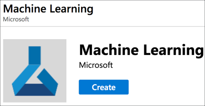
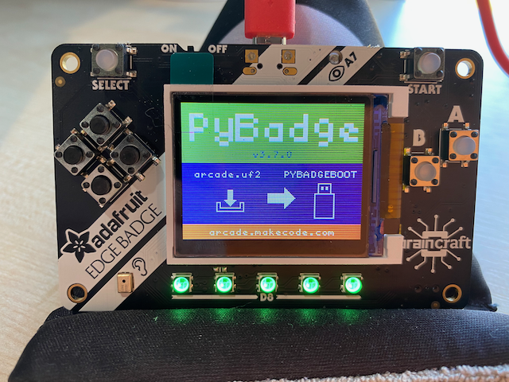

# Recognizing words on a microcontroller using TinyML

AI has traditionally been the realm of expensive computers, with models trained and run on GPUs and other expensive hardware. More recently this has started to change with a move towards TinyML - small machine learning models that are trained on the expensive hardware, but run on smaller, cheaper devices including the low power micro-controllers that run IoT and maker devices.

Adafruit have recently released a device to run TinyML models on called the [EdgeBadge](https://www.adafruit.com/product/4400).


This device is based off their PyBadge device - a board with a screen, game style controllers, NeoPixel LEDs and connectors so you can wear it on a lanyard. The difference with the EdgeBadge is it has a built in microphone so you can use it for audio recognition. The product page has links to a demo you can run that recognizes two words, yes or no, and displays an image on screen when the words are detected.

You can find the demo on [Adafruit Learn](https://learn.adafruit.com/tensorflow-lite-for-edgebadge-kit-quickstart).

I thought it would be fun to repurpose this example and learn how to retrain the board to recognize 'Stop' and 'Go' instead of yes and no.

## Train the model

The yes/no detection model is a TensorFlow model, created using an example from the TensorFlow GitHub repository. The model is trained using a huge file of recordings of people saying a number of different words. Once the model has been trained, it is then shrunk down to run on tiny devices such as micro-controllers, and weighs in at only a few kilobytes.

You can find the original TensorFlow example in the [TensorFlow GitHub repo](https://github.com/tensorflow/docs/blob/master/site/en/r1/tutorials/sequences/audio_recognition.md).

I trained my new model using the [Azure Machine Learning Studio](https://azure.microsoft.com/services/machine-learning/?WT.mc_id=academic-0000-jabenn#product-overview/?WT.mc_id=aiapril-github-jabenn), a service that allows you to build and train models using cloud compute, then either host them in the cloud or download them for use offline.

### Create an Azure account

To use Azure services you will need an Azure subscription. If you don't have a subscription you can sign up for free.

* If you are a student aged 18 and up and have an email address from an academic institution, you can sign up for the free Azure for Students offer at [azure.microsoft.com/free/students](https://azure.microsoft.com/free/students/?WT.mc_id=academic-0000-jabenn) without a credit card. At the time of writing this gives you $100 of credit to use over 12 months, as well as free tiers of a number of services for that 2 months. At the end of the 12 months, if you are still a student you can renew and get another $100 in credit and 12 months of free services.

* If you are not a student, you can sign up at [azure.microsoft.com/free](https://azure.microsoft.com/free/?WT.mc_id=academic-0000-jabenn). You will need a credit card for verification purposes only, you will not be billed unless you decide to upgrade your account to a paid offering. At the time of writing the free account will give you US$200 of free credit to spend on what you like in the first 30 days, 12 months of free services, plus a load of services that have tiers that are always free.

### Create a Machine Learning resource

Before you can use the Azure Machine Learning (ML) Studio, you need to spin up a Machine Learning resource. This is created in your Azure subscription but then can be shared with other developers so that you can all share the same ML Studio workspace.

1. Open the [Azure portal](https://portal.azure.com/?WT.mc_id=academic-0000-jabenn)

1. Select **Create a resource** then search for `Machine Learning`. Select **Machine Learning** then select **Create**.

    

1. Give the workspace a name and select your Azure subscription.

1. Create a new resource group for this service.

    > Resource groups are logic groupings of services, so it is good practice to put all the resources for one project in a single resource group so that you can manage them together. When you create a Machine Learning resource it will create a few different services, so having them in the same resource group means you can delete them all together by deleting the resource group.

1. Select the location nearest to you. For the workspace edition, select **Basic**. This price tier of the core service is free to use, you only pay for the compute used to train or run models.

1. Select **Review + Create**, then select **Create**

The resource will be created.

### Set up ML Studio

Now that the Machine Learning resource has been created, you can use it from ML Studio.

1. Open ML Studio at [ml.azure.com](https://ml.azure.com/?WT.mc_id=academic-0000-jabenn)

1. Log in with your Azure account, then select your directory, subscription and the workspace you just created

1. Select **Get started**

ML Studio will log in to your workspace. From here you can run Machine Learning workloads using Jupyter notebooks, AutoML to create models for you based off data sets, or a drag and drop designer.

### Set up compute

The TensorFlow example uses a Jupyter notebook to train the model. For this, I used a slightly tweaked version of the notebook, tweaked to fix some versioning issues and use the power of ML Studio.

To run a notebook, you need compute - a machine allocated to run the training. This compute is paid for based on the time it's running and the power of the machine, the more powerful, the more you pay per minute.

> You can see the pricing per hour on the [Machine Learning pricing page](https://azure.microsoft.com/pricing/details/machine-learning/?WT.mc_id=academic-0000-jabenn)

1. Select **Compute** from the left-hand menu

1. Select **+ New**

1. Give the compute a name

1. Drop down the *Virtual Machine Size* box, and select **GPU** to list the GPU-based compute options. Select the **Standard_NC12** machine - this has 2 GPUs and is enough to train this model in an hour and a half or so. At the time of writing the cost is US$1.80 per hour when running in the US.

1. Select **Create**

The compute will be created a spun up.

### Upload the notebook

You can find the notebook in the Releases in this GitHub repository. Use this link to download the notebook:

[word-recognizer-training.ipynb](https://github.com/jimbobbennett/EdgeBadge-WordRecogniser/releases/download/v1.0/word-recognizer-training.ipynb).

Once you've downloaded the notebook, you need to upload it to ML Studio.

1. Select **Notebooks** from the left-hand menu

1. Select **Upload files**

1. Find the notebook you've just downloaded, and select it

The notebook will be uploaded and available to run. You will see it in a file tree on the left hand side of the **Notebooks** blade.

1. Select the notebook and it will open up in read only mode

1. Select the compute you created in the menu at the top

1. Select **Edit -> Edit in Jupyter** top open the notebook in Jupyter notebooks. You will need to sign in to your Azure account again.

The notebook has a number of sections, each documented so read the notebook to see what each section does. A basic overview is:

1. Create some environment variables to define the words to train for and the number of training iterations.

1. Install a specific version of TensorFlow GPU to ensure the training uses the GPU, and uses a version that the example training script was written for

   > The training script will only work against TensorFlow 1.5.x, don't update the notebook to a later version otherwise the training will fail

1. Clone the TensorFlow repository to get access to the training script

1. Run the training, then freeze the created TensorFlow graph to save down the weights

1. Convert the model to TensorFlow light to make it smaller, then save it out as binary data in a C code file so that it can be used from code.

From the Jupyter notebooks:

1. The first cell defines the words the model should be trained for.

    ```python
    # A comma-delimited list of the words you want to train for.
    # All other words will be used to train an "unknown" category.
    os.environ["WANTED_WORDS"] = "stop,go"
    ```

    The data set supports the following words:

    |      |       |       |      |
    | ---- | ----- | ----- | ---- |
    | Yes  | No    | Up    | Down |
    | Left | Right | On    | Off  |
    | Stop | Go    | Zero  | One  |
    | Two  | Three | Four  | Five |
    | Six  | Seven | Eight | Nine |

    The notebook is set to train for 'Stop' and 'Go', but if you want to change the words it is trained for, change the array.

1. Select **Run** from the top menu for each cell to run them one at a time, or select **Cell -> Run All** to run all the cells. The training step will take 1.5-2 hours to run.

1. Once the steps have all finished, head back to ML Studio, select **Compute** from the left-hand menu, check the box next to your compute and select **Stop** to stop the compute.

1. Select **Notebooks** from the left-hand menu. Expand the *Content* node above the notebook in the file explorer, and select the `tiny_conv.cc` file. This is the C code for the resulting model.

> Don't forget to stop the compute once the model is trained! You pay for the time that the compute is running, not the time that the notebooks are running, so to avoid unnecessary costs, remember to stop the compute as soon as you are finished, then restart it if you want to train the model again.

## Compile the code for the EdgeBadge

Now that the model is created, it can be compiled into the sample app for the EdgeBadge.

### Set up the development environment

It takes a bit of setup to be able to program Adafruit devices using C++. The Arduino IDE is the main tool for programming them, but I personally like to use Visual Studio Code as an IDE, and the Arduino extension to allow Visual Studio Code to control Arduino to program the boards.

#### Install the tools

1. Install [Visual Studio Code](https://code.visualstudio.com/Download/?WT.mc_id=academic-0000-jabenn)

1. Install the [Arduino IDE](https://www.arduino.cc/en/Main/Software) - **NOTE** On Windows DO NOT install using the Windows store, instead use the *Windows Installer, for Windows XP and up*.

1. Inside Visual Studio Code, select the **Extensions** tab from the left hand side, and search for an install the *Arduino* extension. Make sure to install the one from Microsoft as there is more than one extension called *Arduino*.

#### Configure the Arduino IDE and Visual Studio Code for Adafruit development

To talk to Adafruit boards, the Arduino IDE needs to be configured to know how to send the compiled code.

1. Follow the instructions on the Adafruit site to configure the Arduino IDE for Adafruit boards: [learn.adafruit.com/adafruit-pybadge/using-with-arduino-ide](https://learn.adafruit.com/adafruit-pybadge/using-with-arduino-ide)

1. From Visual Studio Code launch the command palette, then select *Arduino: Library manager*. From here you can install some additional libraries that are needed to compile the code.

1. Search for and install the following libraries:

    1. Adafruit EPD
    1. Adafruit TinyUSB Library
    1. Adafruit WavePlayer Library
    1. Adafruit SPIFlash
    1. Adafruit ImageReader Library
    1. Adafruit ST7735_and_ST7789 Library
    1. Adafruit Unified_Sensor
    1. Adafruit LIS3DH
    1. Adafruit TouchScreen
    1. Adafruit NeoPixel
    1. Adafruit GFX Library
    1. Adafruit Arcada Library
    1. Adafruit Zero_PDM Library
    1. Adafruit ZeroTimer Library
    1. Adafruit TensorFlow Lite
    1. Arduino TensorFlowLite
    1. SdFat - Adafruit Fork (make sure to install the Adafruit fork, not the original SdFat)

#### Configure the board

1. Connect your EdgeBadge to your computer via USB and make sure the device is switched on

1. From the command palette, select *Arduino: Board Configuration*

1. Select the following settings:

    | Setting        | Value                                |
    | -------------- | ------------------------------------ |
    | Selected board | Adafruit pyBadge M4 Express (SAMD51) |
    | Cache          | Enabled                              |
    | CPU Speed      | 180 MHz (overclock)                  |
    | Optimize       | Fastest (-Ofast)                     |
    | Max QSPI       | 50 MHz (standard)                    |
    | USB Stack      | TinyUSB                              |
    | Debug          | Off                                  |

1. From the command palette, select *Arduino: Select serial port* and select the port the EdgeBadge is plugged into. On macOS it will be named something like `/dev/cu.usbmodem<xxx>` where `<xxx>` is a number. On Windows it will be called `COM<x>` where `<x>` is a number.

### Compile the code

The code for the edge badge is in the [word_recognizer](./word_recognizer) folder. Clone this repo and open this folder in Visual Studio Code.

The code contains images and a model that can recognize two words, 'Stop' and 'Go'.

1. Double tap the **Reset** button on the back of the EdgeBadge to put it into the boot loader ready to program

    

1. From the command palette, select *Arduino: Upload*. The code will be compiled and uploaded to the board.

1. Once the device reboots, say the words 'Stop' and 'Go', and the board will show an image for the word you have said.

Select the image below to see a video of this in action.

[](https://www.youtube.com/watch?v=Z0XiTjXCOdk)

### Use your own model

If you want to use your own model trained using Azure ML Studio, you will need to update the code to use this model, and provide image files.

#### Upload image files

1. Create bitmaps for each word that you are detecting, named in the format `<word>.bmp`. For example, if you trained the model for 'Yes' and 'No' you will need `Yes.bmp` and `No.bmp`. These files must be 24-bit bitmaps at a size of 160x128. The best tools to use to create these is good old-fashioned MS Paint on Windows or ImageMagik on macOS.

1. Reset the EdgeBadge. It will mount on your computer with a disk called **CIRCUITPY**

1. Copy the bitmaps into this drive

#### Update the code

1. Open `micro_features_micro_model_settings.cpp`

1. Update `kCategoryLabels` to include the words the model was trained on. Keep `"silence"` and `"unknown"` at the start of the array, and put the words after in the order they were specified in the notebook. Ensure the casing of the words matches the names of the bitmaps created earlier.

    > The words **HAVE** to be in the same order as the notebook or the wrong word will be detected

1. Open `micro_features_micro_model_settings.h

1. Update `kCategoryCount` to be 2 higher than the number of words you trained the model for, so that it is the same as the size of the `kCategoryLabels` array. For example if you trained it for 'Yes' and 'No', set `kCategoryCount` to `4`.

1. Open `micro_features_tiny_conv_micro_features_model_data.cpp`

1. Replace the contents of the `g_tiny_conv_micro_features_model_data` array with the values from `__content_tiny_conv_tflite` in the `tiny_conv.cc` file downloaded from the Azure ML Studio notebook

1. Replace the value of `g_tiny_conv_micro_features_model_data_len` with the value of `__content_tiny_conv_tflite_len` from the `tiny_conv.cc` file downloaded from the Azure ML Studio notebook

1. Use the steps above to compile and deploy this new code to the device, then test it out.

